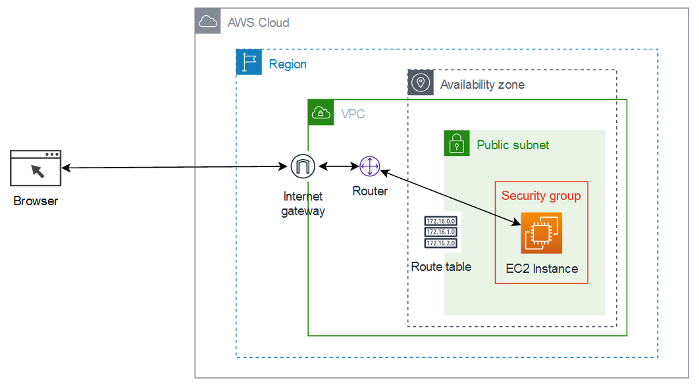

# Project 01: Simple EC2 Webserver

This project creates a VPC, a public subnet inside the VPC and EC2 instance in that public subnet. EC2 instance acts as a simple webserver.



Instead of defining all resources individually, this project leverages Terraform AWS modules as it simplifies our code.

This project uses the following modules:
- [vpc](https://registry.terraform.io/modules/terraform-aws-modules/vpc/aws)
- [ec2-instance](https://registry.terraform.io/modules/terraform-aws-modules/ec2-instance/aws)
- [security-group](https://registry.terraform.io/modules/terraform-aws-modules/security-group/aws)


**NOTE:** 
When the EC2 instance is created, an existing key pair is used. The following command can be used to import an existing key pair into Terraform (replace `key-pair-name` with the name of your key pair).
### Import existing resources into Terraform state
```
terraform import aws_key_pair.personal key-pair-name
```